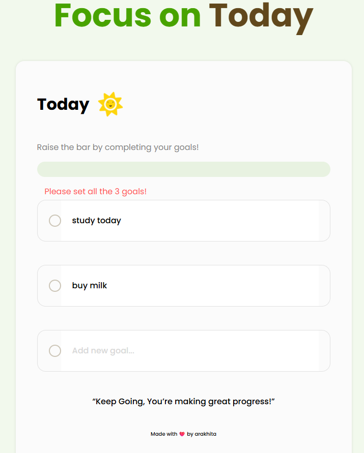
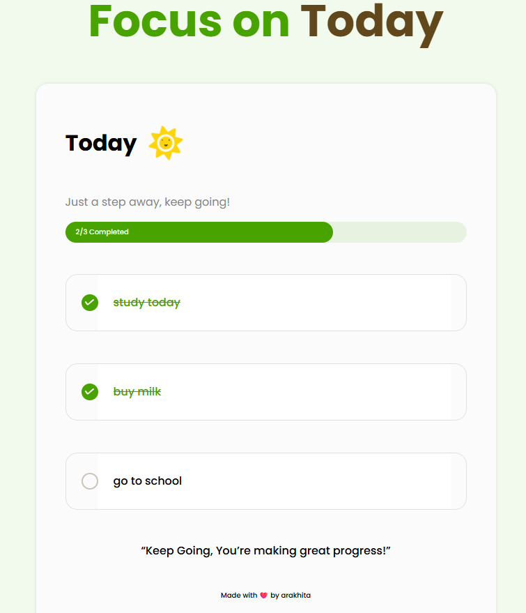

# Focus On Today 🕒✨

A simple and motivating task management web app that helps users stay focused on their daily goals.  
This project encourages productivity by allowing users to add tasks and mark them as completed.

---

## 🚀 Features
- ✅ Add daily focus tasks
- ✅ Mark tasks as completed
- ✅ Clean and minimal UI for distraction-free workflow
- ✅ Local storage support (data remains even after refresh)

---

## 🛠️ Tech Stack
- **HTML**
- **CSS**
- **JavaScript (Vanilla JS)**

---

## 📸 Screenshots

### ✅ Home Page UI

### ✅ Task Completed State

## 🧠 Learning
This project helped me understand:
- DOM Manipulation  
- Local Storage in JavaScript  
- UI structuring and minimal UX design

## 🙌 Author
**Arakhita Sabata**  
Feel free to star ⭐ this repo if you like it!

